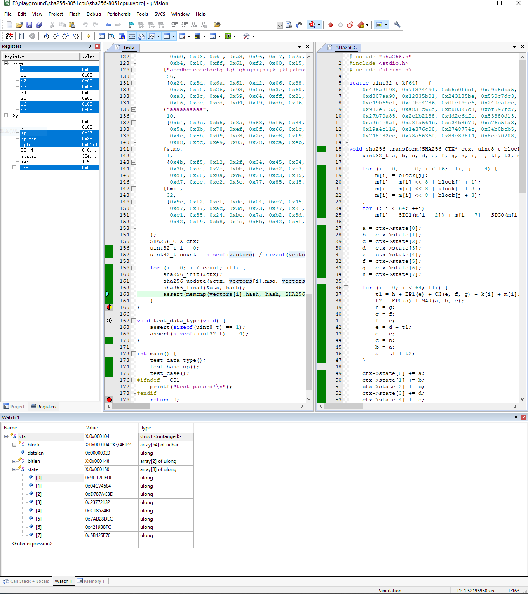
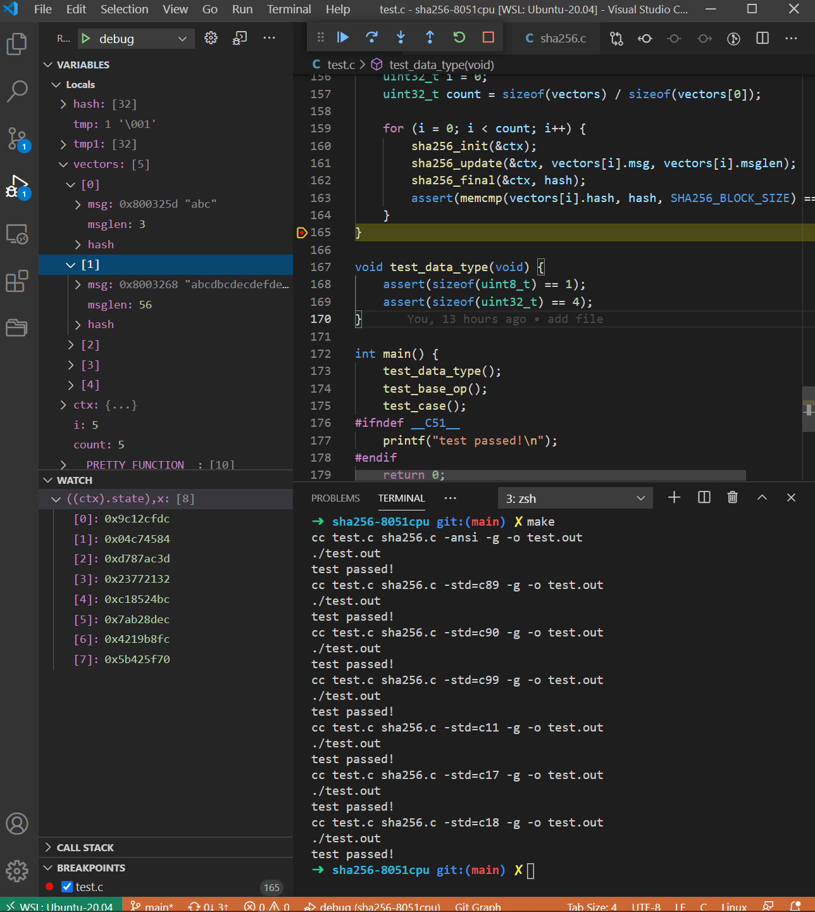

1. The project began in [SHA256_embedded](https://github.com/MinfonTsai/SHA256_embedded)'s sha256 files.
1. I only ported to embedded chips, such as Intel 8051 series CPUs.
1. Supported compilers are: 
    1. GCC ANSI, C89, C9X, C1X
    1. Keil CX51.

# run 
1. `git clone git@github.com:iroan/sha256-8051cpu.git`
1. `cd sha256-8051cpu && make`

# usage
1. `#include "sha256.h"`
1. add code:
    ```c
    sha256_init(&ctx);
    sha256_update(&ctx, msg, msglen);
    sha256_final(&ctx, result);
    ```
1. compile project with `sha256.c`


